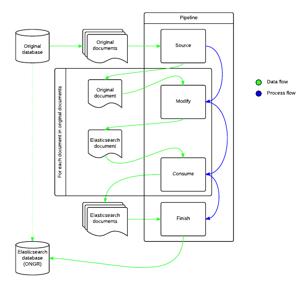

Import functionality
====================

Import functionality allows you to import your data from any defined source into any relevant consumer while modifying it.

Import functionality overview
-----------------------------

|import_overview|

For more information about how Pipeline works, see `Pipeline documentation <../Pipeline/pipeline.rst>`_.

Running full import
-------------------

Use `Full Import command <../Commands/ImportFullCommand/index.rst>`_ to run full import.

Running sync import
-------------------

Use `Sync Import command <../Commands/SyncExecuteCommand/index.rst>`_ to run sync import.

Implementing your data import
-----------------------------

Defining a source (data provider)
~~~~~~~~~~~~~~~~~~~~~~~~~~~~~~~~~

To define your own source you need to create a source event listener.

Take, for example, this predefined ImportSourceEventListener:

.. code-block:: php

    class ImportSourceEventListener extends AbstractImportSourceEventListener
    {
        /**
         * @var EntityManager $entityManager
         */
        protected $entityManager;

        /**
         * @var string $entityClass Type of source.
         */
        protected $entityClass;

        /**
         * @var Manager $elasticsearchManager
         */
        protected $elasticsearchManager;

        /**
         * @var string Classname of Elasticsearch document. (e.g. Product).
         */
        protected $documentClass;

        /**
         * Gets all documents by given type.
         *
         * @return DoctrineImportIterator
         */
        public function getAllDocuments()
        {
            return new DoctrineImportIterator(
                $this->entityManager->createQuery("SELECT e FROM {$this->entityClass} e")->iterate(),
                $this->entityManager,
                $this->elasticsearchManager->getRepository($this->documentClass)
            );
        }

        /**
         * Gets data and adds source.
         *
         * @param SourcePipelineEvent $event
         */
        public function onSource(SourcePipelineEvent $event)
        {
            $event->addSource($this->getAllDocuments());
        }
    }

..

In this example getAllDocuments() method will return all needed data.
It is very important to have onSource() method included, which defines the behaviour of your source event.

Next step is adding your source settings into YAML configuration:

.. code-block:: yaml

    my.import.source:
           class: %my.import.source.class%
           parent: ongr_connections.import.source
           arguments:
             - @doctrine.orm.my_entity_manager
             - %my.doctrine.entity.class%
             - @es.manager
             - %my.elasticsearch.entity.class%
           tags:
             - { name: kernel.event_listener, event: ongr.pipeline.import.default.source, method: onSource }

..

Defining a modifier
~~~~~~~~~~~~~~~~~~~

Defining a data modifier event listener is revolving around the same pattern.

Create modifier event listener class, configure YAML.

Example:

.. code-block:: php

    class ImportModifyEventListener extends AbstractImportModifyEventListener
    {
        /**
         * Assigns data in entity to relevant fields in document.
         *
         * @param AbstractImportItem $eventItem
         */
        protected function modify(AbstractImportItem $eventItem)
        {
            /** @var Product $data */
            $data = $eventItem->getEntity();
            /** @var Product $document */
            $document = $eventItem->getDocument();
            $document->setId($data->id);
            $document->setTitle($data->title);
            $document->setPrice($data->price);
            $document->setDescription($data->description);
        }
    }

..

.. code-block:: yaml

       my.import.modifier:
           class: %my.import.modifier.class%
           tags:
             - { name: kernel.event_listener, event: ongr.pipeline.import.default.modify, method: onModify }

..

Defining a consumer
~~~~~~~~~~~~~~~~~~~

Consumers are rather similar to modifiers with one key difference: while modifiers are expected to modify items, consumers are to consume items, e.g. put them into database.

The definition is roughly the same as all event listeners:

Create modifier event listener class, configure YAML.

Example:

.. code-block:: php

    /**
     * ImportConsumeEventListener class, called after modify event. Puts document into Elasticsearch.
     */
    class ImportConsumeEventListener extends AbstractImportConsumeEventListener implements LoggerAwareInterface
    {
        /**
         * {@inheritdoc}
         */
        public function __construct(Manager $manager)
        {
            parent::__construct($manager, 'ONGR\ConnectionsBundle\Import\Item\ImportItem');
        }
    }
..

.. code-block:: yaml

       my.import_consumer:
           class: %my.import_consumer.class%
           parent: ongr_connections.import_consumer
               arguments:
                 - @es.manager
               tags:
                  - { name: kernel.event_listener, event: ongr.pipeline.import.default.consume, method: onConsume }
..

Defining start event listener
~~~~~~~~~~~~~~~~~~~~~~~~~~~~~

You can also define some behavior on the start event, which is being processed before the start of the pipeline's loop (but after source event).

Your event will receive a StartPipelineEvent object, which contains the pipeline context and a number of items registered inside it.

To listen on start event, use something similar to this in your config:

.. code-block:: yaml

       my.import_start:
           class: %my.import_start.class%
               tags:
                  - { name: kernel.event_listener, event: ongr.pipeline.import.default.start, method: onStart }
..

Defining finish event listener
~~~~~~~~~~~~~~~~~~~~~~~~~~~~~~

Finish event is executed at the end of the pipeline's life cycle, so you can attach your needed custom behaviour to it, e.g. commit every change made during pipeline's loop to ElasticSearch repository.

Example:

.. code-block:: php

    class ImportFinishEventListener
    {
        /**
         * @var Manager $manager
         */
        protected $manager;

        /**
         * @param Manager $manager
         */
        public function __construct(Manager $manager)
        {
            $this->manager = $manager;
        }

        /**
         * Finish and commit.
         */
        public function onFinish()
        {
            $this->manager->commit();
        }
    }
..

.. code-block:: yaml

       my.import_finish:
           class: %my.import_finish.class%
           parent: ongr_connections.import_finish
           arguments:
             - @es.manager
           tags:
             - { name: kernel.event_listener, event: ongr.pipeline.import.default.finish, method: onFinish }
..

Using different pipeline names
~~~~~~~~~~~~~~~~~~~~~~~~~~~~~~

You can use different event names in case you have situations when it is impossible to use a single pipeline, e.g. you have different data flows (mysql->elasticsearch and elasticsearch->mongo).

Configure your event listeners to use event names in following pattern: ongr.pipeline.import.{$name}.(source | start | modify | consume | finish).

e.g.:

.. code-block:: yaml

       my.import_finish:
           class: %my.import_finish.class%
           parent: ongr_connections.import_finish
           arguments:
             - @es.manager
           tags:
             - { name: kernel.event_listener, event: ongr.pipeline.import.MySpecialEventName.finish, method: onFinish }
..

And call *ongr:connections:import* command using *{$name}*, e.g. ongr:connections:import MySpecialEventName

See command usage for usage details.

Internals provided for custom import
~~~~~~~~~~~~~~~~~~~~~~~~~~~~~~~~~~~~

There are abstract EventListeners provided by the pipeline:

.. toctree::
        :maxdepth: 1
        :glob:

        ../Pipeline/EventListeners/abstract_import_source_event_listener
        ../Pipeline/EventListeners/abstract_import_modify_event_listener
        ../Pipeline/EventListeners/abstract_import_consume_event_listener
        ../Pipeline/EventListeners/abstract_import_finish_event_listener

as well as an implementation of `memory-efficient iterator for Doctrine ORM <Internals/doctrine_import_iterator.rst>`_
